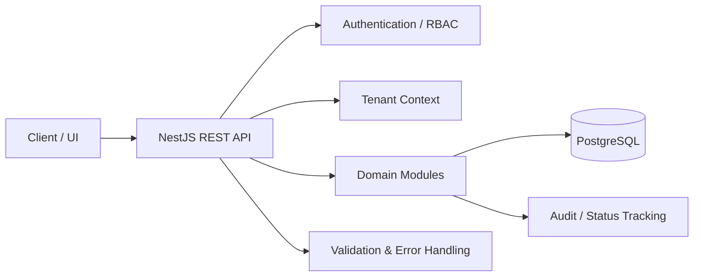

# SecurePlan

**Backend Engineering Case Study · THM Praxisphase · B2B-SaaS Workforce Planning**

SecurePlan ist ein webbasiertes System zur strukturierten Personal- und Einsatzplanung für Sicherheitsunternehmen. Das Projekt entsteht im Rahmen meiner Praxisphase im B.Sc. Informatik an der Technischen Hochschule Mittelhessen (THM).

> **Projektstatus:** Architektur- und Planungsphase  
> **Aktueller Gate:** Phase 6.5 – Transactions, Concurrency & Idempotency  
> **Wichtig:** Es existiert aktuell noch kein nachgewiesener Produktions-Anwendungscode. UX-Prototypen und Architekturartefakte sind dokumentiert, aber nicht als implementierte Produktfunktionen zu verstehen.

---

## 30-Sekunden-Überblick

| Bereich | Inhalt |
|---|---|
| Problem | Personal- und Einsatzplanung mit Rollen, Abwesenheiten, Ersatzprozessen und verbindlichen Business Rules |
| Produkttyp | B2B-SaaS |
| Architekturziel | Modularer Backend-Service mit klaren Domänengrenzen, RBAC, Tenant Context und auditierbaren Workflows |
| Geplanter Backend-Stack | TypeScript · NestJS · PostgreSQL · REST APIs |
| Engineering-Fokus | Requirements · API Design · Data Modeling · RBAC · Validation · Transactions · Concurrency · Testing · CI/CD |
| Aktueller Stand | Requirements, Scope, Product Research, Systemanalyse, UX/UI und Architektur bis Phase 6.4 abgeschlossen |

---

## Das Problem

In Sicherheitsunternehmen müssen Mitarbeiter, Schichten, Projekte, Abwesenheiten und Ersatzbesetzungen koordiniert werden. Dabei entstehen mehrere technische Herausforderungen gleichzeitig:

- unterschiedliche Benutzerrollen und Berechtigungen,
- verbindliche Regeln für Planung und Besetzung,
- parallele Änderungen an denselben Planungsdaten,
- nachvollziehbare Entscheidungen und Statusänderungen,
- klare Trennung zwischen Tenant-Daten in einem B2B-SaaS-Modell.

SecurePlan bildet diese Prozesse nicht nur als UI ab, sondern behandelt sie als explizite Backend-Domäne mit dokumentierten Regeln und Architekturentscheidungen.

---

## Meine Rolle im Projekt

Ich bearbeite SecurePlan als Praxisphasenprojekt end-to-end von der Problemdefinition bis zur geplanten technischen Umsetzung.

Mein bisheriger Schwerpunkt umfasst:

- Requirements Engineering und Scope-Definition,
- Zielgruppen- und Wettbewerbsanalyse,
- Definition des verbindlichen MVP,
- Modellierung von Rollen, Berechtigungen und Geschäftsprozessen,
- Systemanalyse und Architekturentscheidungen,
- API- und Datenmodellplanung,
- Vorbereitung von Validation, Error Handling, Testing und CI,
- Dokumentation von Change Requests und Architecture Gates.

Dabei trenne ich bewusst zwischen **DOCUMENTED**, **PROTOTYPED** und **IMPLEMENTED**, damit der Projektstatus technisch nachvollziehbar bleibt.

---

## Architektur-Snapshot

### Zentrale Architekturthemen

**RBAC & Tenant Context**  
Mitarbeiter, Schichtleiter und Administratoren benötigen unterschiedliche Berechtigungen. Gleichzeitig gehört jedes Tenant-Benutzerkonto genau zu einer Company.

**Business Rules**  
Planung darf nicht nur über UI-Logik abgesichert werden. Regeln wie Verfügbarkeit, Rollenrechte und zulässige Statusübergänge müssen serverseitig validiert werden.

**Concurrency & Idempotency**  
Parallele Änderungen an Einsatz- und Ersatzprozessen dürfen nicht zu Doppelbesetzungen oder inkonsistenten Zuständen führen. Der aktuelle Architecture Gate behandelt deshalb Transaktionsgrenzen, Optimistic Locking, Duplicate Protection und Idempotency.

**Auditierbarkeit**  
Wichtige Statusänderungen und Entscheidungen sollen nachvollziehbar bleiben, ohne das MVP mit unnötiger Komplexität zu überladen.

---

## Verbindlicher MVP

Der aktuelle Praktikums-MVP umfasst:

1. Foundation
2. Authentifizierung, RBAC und Tenant Context
3. Mitarbeiter und Projekte
4. Manueller Monatsplan mit Publish und Mitarbeiteransicht
5. Absage- und Ersatzprozess
6. Planbasierte Statistik
7. Admin Work Queue
8. Validation, Error Handling, Audit-Minimum, Tests, OpenAPI und CI
9. Reproduzierbare Demo-/Staging-Auslieferung

**Stretch:** Excel-Import  
**Nicht Teil des verbindlichen 3-Monats-MVP:** Tagesplan, Lohnabrechnung und vollständige Notifications

Die wirksame Baseline ist dokumentiert unter  
[docs/requirements/effective-mvp-baseline.md](docs/requirements/effective-mvp-baseline.md).

---

## Produkt- und Tenant-Modell

- SecurePlan ist als **B2B-SaaS** konzipiert.
- Eine **Company entspricht einem Tenant**.
- Ein Tenant-Benutzerkonto gehört genau einer Company.
- Kein Company Switcher und keine Cross-Company-Membership im MVP.
- Platform Admin wird als separater Provider-Scope behandelt.
- Monate 1–3: Praktikums-MVP mit einer operativen Company, aber tenant-aware Architektur.
- Monate 4–6: geplante Productization und Multi-Company-Erweiterung.

---

## Aktueller Projektstatus

| Phase | Status |
|---|---|
| Requirements Baseline | FINAL / APPROVED / FROZEN |
| Scope & MVP | FINAL / APPROVED / FROZEN |
| Product Research & Validation | FINAL / APPROVED |
| B2B-SaaS Tenant Model | FINAL / APPROVED |
| Systemanalyse | FINAL / APPROVED |
| UX/UI | PASS FOR PHASE 6 |
| Architektur Phase 6.1–6.4 | FINAL / APPROVED |
| Phase 6.5 – Transactions, Concurrency & Idempotency | CURRENT |
| Feature-Implementierung | NOCH NICHT BEGONNEN / NICHT NACHGEWIESEN |

Vollständiger Status: [docs/project-status.md](docs/project-status.md)

---

## Engineering Evidence

Für technische Reviewer und Recruiter sind insbesondere diese Dokumente relevant:

| Artefakt | Was es zeigt |
|---|---|
| [Architekturüberblick](docs/architektur/ueberblick.md) | Architekturentscheidungen und aktueller Phase-6-Stand |
| [Effective MVP Baseline](docs/requirements/effective-mvp-baseline.md) | Scope-Disziplin und Anforderungen |
| [Systemanalyse](docs/systemanalyse/phase-4-final-v1.2.md) | Domänen- und Systemanalyse |
| [UX/UI Baseline](docs/ux-ui/phase-5-baseline.md) | Übergang von Anforderungen zu Interaktionsdesign |
| [Projektstatus](docs/project-status.md) | Nachweisbarer Fortschritt und Gates |
| [12-Wochen-Fahrplan](docs/planung/fahrplan-12-wochen.md) | Implementierungsplanung |
| [Fortschrittsprotokoll](docs/planung/fortschrittsprotokoll.md) | Tatsächlich dokumentierter Projektfortschritt |

Gesamter Dokumentationsindex: [docs/README.md](docs/README.md)

---

## Was das Projekt demonstriert

SecurePlan dient mir nicht nur als Produktprojekt, sondern als Engineering Case Study. Der aktuelle Stand demonstriert insbesondere:

- strukturiertes Requirements Engineering,
- kontrolliertes Scope- und Change-Management,
- Modellierung realer Business Rules,
- rollenbasierte Zugriffskontrolle,
- B2B-SaaS- und Tenant-Denken,
- Architekturentscheidungen vor Implementierung,
- Umgang mit Concurrency und Idempotency,
- nachvollziehbare technische Dokumentation.

Mit Beginn der Implementierungsphase wird diese Evidenz um ausführbaren Backend-Code, Tests, OpenAPI-Dokumentation, Docker/CI und eine reproduzierbare Demo erweitert.

---

## Nächste technische Schritte

1. Phase 6.5 abschließen: Transactions, Concurrency, Optimistic Locking, Idempotency
2. Security-, API- und Datenmodell-Details finalisieren
3. Architecture Review abschließen
4. NestJS/PostgreSQL-Projektstruktur aufsetzen
5. Authentifizierung, RBAC und Tenant Context implementieren
6. MVP-Module inkrementell umsetzen
7. Tests, OpenAPI, Docker und CI ergänzen
8. Demo-/Staging-Auslieferung vorbereiten

---

## Projektprinzip

**Dokumentiert ist nicht implementiert. Prototypisiert ist nicht produktionsreif.**

SecurePlan wird deshalb bewusst über nachvollziehbare Gates entwickelt: von Problem und Requirements über Systemanalyse und Architektur bis zur Implementierung und überprüfbaren Software.
