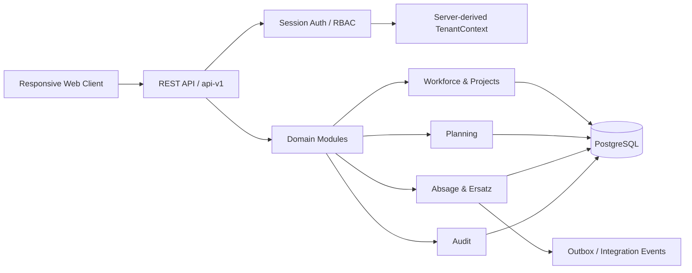

# SecurePlan

**Backend Engineering Case Study · THM Praxisphase · B2B-SaaS Workforce Planning**

SecurePlan ist ein webbasiertes System zur strukturierten Personal- und Einsatzplanung für Sicherheitsunternehmen. Das Projekt entsteht im Rahmen meiner Praxisphase im B.Sc. Informatik an der Technischen Hochschule Mittelhessen (THM).

> **Projektstatus:** Architektur- und Planungsphase  
> **Architekturstand:** Phase 6.1–6.7 FINAL / APPROVED  
> **Nächster Abschnitt:** Phase 6.8  
> **Implementierungsstatus:** Noch kein nachgewiesener Produktions-Anwendungscode. Architektur-, UX- und Planungsartefakte sind dokumentiert, aber nicht als implementierte Produktfunktionen zu verstehen.

---

## 30-Sekunden-Überblick

| Bereich | Inhalt |
|---|---|
| Problem | Personal- und Einsatzplanung mit Rollen, Abwesenheiten, Ersatzprozessen und verbindlichen Business Rules |
| Produkttyp | B2B-SaaS |
| Architektur | Tenant-aware Modular Monolith |
| Geplanter Backend-Stack | TypeScript · NestJS · PostgreSQL · REST APIs |
| Kernkonzepte | RBAC · Tenant Isolation · Transactions · Optimistic Locking · Idempotency · API Contracts · Audit |
| Aktueller Stand | Requirements, Scope, Product Research, Systemanalyse, UX/UI sowie Architektur Phase 6.1–6.7 abgeschlossen |
| Nächster Schritt | Phase 6.8 und anschließend finales Architecture Gate vor Implementierungsstart |

---

## Das Problem

In Sicherheitsunternehmen müssen Mitarbeiter, Projekte, Monatspläne, Abwesenheiten und Ersatzbesetzungen zuverlässig koordiniert werden.

Daraus entstehen mehrere Backend-Herausforderungen:

- unterschiedliche Benutzerrollen und Berechtigungen,
- Tenant-Isolation in einem B2B-SaaS-Modell,
- verbindliche Regeln für Planung und Ersatzbesetzung,
- parallele Änderungen an denselben Planungsdaten,
- sichere und wiederholbare Command-Verarbeitung,
- stabile API- und Error-Contracts,
- nachvollziehbare Statusänderungen und Audit Events.

SecurePlan behandelt diese Anforderungen als explizite Backend-Domäne und nicht nur als UI-Workflow.

---

## Meine Rolle im Projekt

Ich bearbeite SecurePlan als Praxisphasenprojekt end-to-end von der Problemdefinition bis zur geplanten technischen Umsetzung.

Mein bisheriger Schwerpunkt umfasst:

- Requirements Engineering und Scope-Definition,
- Zielgruppen- und Wettbewerbsanalyse,
- Definition und Governance des MVP,
- Modellierung von Rollen, Berechtigungen und Geschäftsprozessen,
- Systemanalyse und Domain-Schnitt,
- Architektur eines tenant-aware Modular Monolith,
- Definition von Modulgrenzen und Public Contracts,
- Transaktions-, Concurrency- und Idempotency-Design,
- Security Architecture und RBAC,
- REST API-, DTO- und Error-Contract-Design,
- Vorbereitung von Testing, OpenAPI, CI/CD und Deployment.

Dabei trenne ich bewusst zwischen **DOCUMENTED**, **PROTOTYPED** und **IMPLEMENTED**, damit der Projektstatus technisch nachvollziehbar bleibt.

---

## Architektur-Snapshot



### Architekturprinzipien

**Tenant-aware Modular Monolith**  
SecurePlan startet bewusst als modularer Monolith. Fachliche Module besitzen klare Verantwortlichkeiten und kommunizieren ausschließlich über definierte Public Contracts.

**RBAC & Tenant Isolation**  
TenantContext wird serverseitig aus der authentifizierten Identität abgeleitet. Client-seitig gelieferte Company-IDs sind keine Trust Source. Cross-Company Reads und Writes sind verboten.

**Business Rules im Backend**  
Planungs-, Berechtigungs- und Statusregeln werden serverseitig validiert und nicht ausschließlich der UI überlassen.

**Consistency by Design**  
Kritische Workflows berücksichtigen Transaction Boundaries, Optimistic Locking, Duplicate Protection und Idempotency.

**Stable API Contracts**  
REST-Endpunkte, Commands, DTOs, Validation und Domain Errors werden als explizite Verträge behandelt.

---

## Architekturfortschritt – Phase 6

### 6.1 – Architecture Goals & Quality Attributes
**FINAL / APPROVED**

Festlegung der Architekturziele und Qualitätsattribute als technische Leitplanken.

### 6.2 – System Context & Container View
**FINAL / APPROVED**

Definierter Systemkontext:

```text
Responsive Web Client
        ↓
REST Backend
        ↓
PostgreSQL
```

Grundentscheidung: tenant-aware Modular Monolith.

### 6.3 – Backend Building Blocks
**FINAL / APPROVED**

Definierte fachliche Building Blocks:

1. Platform & Tenant Management
2. Identity & Access
3. Workforce & Projects
4. Planning
5. Absage & Ersatz
6. Audit

Read Capabilities:

- Employee Statistics
- Admin Work Queue

### 6.4 – Module Dependencies & Public Contracts
**FINAL / APPROVED**

Festgelegte Regeln:

- kein Cross-Module Repository Access,
- keine direkten Cross-Module Table Mutations,
- keine zyklischen Dependencies,
- Kommunikation über explizite Public Application Contracts.

### 6.5 – Transactions, Concurrency & Consistency
**FINAL / APPROVED**

Architekturentscheidungen zu:

- Transaction Boundaries,
- Commit/Rollback über kritische Workflows,
- Optimistic Locking,
- Idempotency,
- Duplicate Protection,
- Race Conditions,
- Audit-Verhalten in kritischen Transaktionen,
- Outbox-orientierter Verarbeitung von Integrationsereignissen.

Ziel ist insbesondere, Doppelbesetzungen und inkonsistente Zustände bei parallelen Änderungen zu verhindern.

### 6.6 – Security Architecture & RBAC
**FINAL / APPROVED**

Definierte Security-Baseline:

- serverseitige Session-basierte Authentifizierung,
- sichere HttpOnly-Cookies,
- rollen- und kontextbasierte Autorisierung,
- server-derived TenantContext,
- konsequente Tenant Isolation,
- Resource Ownership Checks,
- CSRF-Schutz,
- sichere Password-Hashing-Strategie,
- Trennung von Business Audit, Security Events und technischen Logs.

Platform Admin und Company Admin bleiben getrennte Sicherheitskontexte.

### 6.7 – API & Integration Architecture
**FINAL / APPROVED**

Definierte API- und Integrationsprinzipien:

- REST als primäre externe API,
- explizite Commands für fachliche Mutationen,
- versionierte API unter `/api/v1`,
- serverseitige Validation,
- stabile DTO-Contracts,
- konsistente Domain- und Error-Codes,
- Trennung von Tenant Plane und Provider/Control Plane,
- Integrationsereignisse über Outbox-orientierte Mechanismen,
- Security-, Contract- und Integration-Tests als Teil der späteren Implementierungsbaseline.

---

## Verbindlicher Praktikums-MVP

Der aktuelle MVP umfasst:

1. Foundation
2. Authentifizierung, RBAC und Tenant Context
3. Mitarbeiter und Projekte
4. Manueller Monatsplan mit Publish und Mitarbeiteransicht
5. Absage- und Ersatzprozess
6. Planbasierte Statistik
7. Admin Work Queue
8. Validation, Error Handling, Audit-Minimum, Tests, OpenAPI und CI
9. Reproduzierbare Demo-/Staging-Auslieferung

**Stretch:** Excel-Import

**Nicht Teil des verbindlichen 3-Monats-MVP:** Tagesplan, Lohnabrechnung und vollständige Notifications.

Die wirksame Baseline ist dokumentiert unter  
[docs/requirements/effective-mvp-baseline.md](docs/requirements/effective-mvp-baseline.md).

---

## Produkt- und Tenant-Modell

- SecurePlan ist als **B2B-SaaS** konzipiert.
- Eine **Company entspricht einem Tenant**.
- Ein Tenant-Benutzerkonto gehört genau einer Company.
- Kein Company Switcher und keine Cross-Company-Membership.
- Platform Admin ist ein separater Provider-Scope.
- Platform Admin besitzt kein implizites Recht auf operative Tenant-Daten.
- Shared Database + Shared Schema ist die bevorzugte Startstrategie.
- Monate 1–3: Praktikums-MVP mit einer operativen Company, technisch bereits tenant-aware.
- Monate 4–6: geplante Multi-Company/Productization.

---

## Aktueller Projektstatus

| Bereich | Status |
|---|---|
| Requirements Engineering | FINAL / APPROVED / FROZEN |
| Scope & MVP | FINAL / APPROVED / FROZEN |
| Product Research & Validation | FINAL / APPROVED |
| B2B-SaaS Tenant Model | FINAL / APPROVED |
| Systemanalyse | FINAL / APPROVED |
| UX/UI | PASS FOR PHASE 6 |
| Phase 6.1 – Architecture Goals | FINAL / APPROVED |
| Phase 6.2 – Context & Containers | FINAL / APPROVED |
| Phase 6.3 – Backend Building Blocks | FINAL / APPROVED |
| Phase 6.4 – Dependencies & Public Contracts | FINAL / APPROVED |
| Phase 6.5 – Transactions & Consistency | FINAL / APPROVED |
| Phase 6.6 – Security Architecture & RBAC | FINAL / APPROVED |
| Phase 6.7 – API & Integration Architecture | FINAL / APPROVED |
| Phase 6.8 | NEXT |
| Production Feature Code | NOT IMPLEMENTED / NOT EVIDENCED |

> Hinweis: Die detaillierten repo-lokalen Status-/Architekturdokumente für Phase 6.5–6.7 werden mit dem nächsten vollständigen Repository-Sync konsolidiert. Dieser README spiegelt bereits den freigegebenen Arbeitsstand bis Phase 6.7 wider.

---

## Engineering Evidence

Für technische Reviewer und Recruiter sind insbesondere diese Artefakte relevant:

| Artefakt | Was es zeigt |
|---|---|
| [Effective MVP Baseline](docs/requirements/effective-mvp-baseline.md) | kontrollierter Scope und Requirements |
| [Systemanalyse](docs/systemanalyse/phase-4-final-v1.2.md) | Domain- und Systemanalyse |
| [UX/UI Baseline](docs/ux-ui/phase-5-baseline.md) | Übergang von Anforderungen zu Interaktionsdesign |
| [Architekturüberblick](docs/architektur/ueberblick.md) | Architekturstruktur und Building Blocks |
| [Phase 6.3](docs/architektur/phase-6-3-backend-building-blocks.md) | Modulgrenzen und Ownership |
| [Phase 6.4](docs/architektur/phase-6-4-module-dependencies-public-contracts.md) | Dependencies und Public Contracts |
| [Projektstatus](docs/project-status.md) | repo-lokaler Gate- und Phasenstand |
| [Fortschrittsprotokoll](docs/planung/fortschrittsprotokoll.md) | dokumentierter Projektfortschritt |

---

## Was SecurePlan aktuell demonstriert

Der aktuelle Projektstand liefert noch keinen Produktionscode, zeigt aber bereits Engineering-Arbeit in mehreren Bereichen:

- Requirements Engineering,
- Product Scope und Change Management,
- Domain Modeling,
- B2B-SaaS Multi-Tenancy,
- Modular-Monolith-Architektur,
- Modulgrenzen und Ownership,
- RBAC und Tenant Isolation,
- Transaction Design,
- Concurrency und Optimistic Locking,
- Idempotency und Duplicate Protection,
- REST API Design,
- DTO- und Error Contracts,
- Audit- und Integration-Event-Design,
- technische Dokumentation und Architecture Gates.

Mit Beginn der Implementierungsphase wird diese Evidenz um ausführbaren Backend-Code, Datenbankmigrationen, Tests, OpenAPI, Docker, CI/CD und eine reproduzierbare Demo erweitert.

---

## Nächste technische Schritte

1. Phase 6.8 bearbeiten und freigeben
2. verbleibende Architekturentscheidungen und ADRs konsolidieren
3. vollständiges Architecture Review durchführen
4. Human Approval für den Implementierungsstart
5. NestJS/PostgreSQL-Projektstruktur aufsetzen
6. Authentication, RBAC und TenantContext implementieren
7. MVP-Module inkrementell entwickeln
8. Tests, OpenAPI, Docker und CI/CD ergänzen
9. Demo-/Staging-Auslieferung vorbereiten

---

## Projektprinzip

**Dokumentiert ist nicht implementiert. Prototypisiert ist nicht produktionsreif.**

SecurePlan wird bewusst über nachvollziehbare Gates entwickelt:

```text
Requirements
    ↓
Scope & Product Validation
    ↓
System Analysis
    ↓
UX / UI
    ↓
Architecture
    ↓
Human Approval
    ↓
Implementation
    ↓
Testing & Delivery
```

Ziel ist nicht, möglichst früh Code zu produzieren, sondern eine nachvollziehbare, testbare und wartbare Backend-Lösung für reale Business-Prozesse zu entwickeln.
