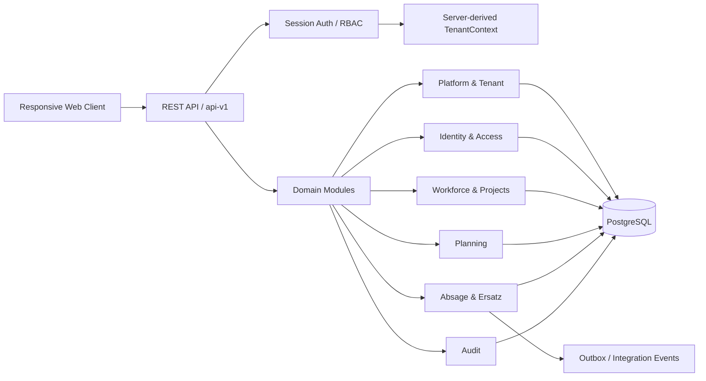

# SecurePlan

**Backend Engineering Case Study · THM Praxisphase · B2B-SaaS Workforce Planning**


SecurePlan ist ein webbasiertes System zur strukturierten Personal- und Einsatzplanung für Sicherheitsunternehmen.  
Das Projekt entsteht im Rahmen meiner **Praxisphase im B.Sc. Informatik an der Technischen Hochschule Mittelhessen (THM)**.

> **Stand: 24.09.2026**  
> **Architektur:** Phase 6.1–6.7 FINAL / APPROVED  
> **Nächster Schritt:** Phase 6.8 → finales Architecture Gate → Human Approval → Implementierung  
> **Implementierung:** Noch kein nachgewiesener Produktions-Anwendungscode. Architektur-, UX- und Planungsartefakte sind nicht mit implementierter Produktfunktion gleichzusetzen.

---

## 30-Sekunden-Überblick

| Bereich | Aktueller Stand |
|---|---|
| **Problem** | Personal- und Einsatzplanung mit Rollen, Abwesenheiten, Ersatzprozessen und verbindlichen Business Rules |
| **Produkttyp** | B2B-SaaS |
| **Architekturstil** | Tenant-aware Modular Monolith |
| **Geplanter Backend-Stack** | TypeScript · NestJS · PostgreSQL · REST APIs |
| **Security** | Session Auth · RBAC · server-derived TenantContext · Tenant Isolation · CSRF |
| **Consistency** | Transactions · Optimistic Locking · Idempotency · Duplicate Protection |
| **API** | REST · `/api/v1` · DTO Contracts · Validation · stabile Domain/Error Codes |
| **Integration** | Outbox-orientierte Integration Events |
| **Architekturfortschritt** | Phase 6.1–6.7 abgeschlossen und freigegeben |
| **Nächster Gate** | Phase 6.8 und finales Architecture Review |

---

## Problem & Ziel

Sicherheitsunternehmen müssen Mitarbeiter, Projekte, Monatspläne, Abwesenheiten und Ersatzbesetzungen zuverlässig koordinieren.

Dabei entstehen Backend-Herausforderungen wie:

- rollen- und kontextabhängige Berechtigungen,
- Tenant-Isolation in einem B2B-SaaS-Modell,
- komplexe Planungs- und Ersatzregeln,
- parallele Änderungen an denselben Planungsdaten,
- Duplicate Protection und wiederholbare Commands,
- stabile API-, DTO- und Error-Contracts,
- nachvollziehbare Audit- und Statusänderungen.

SecurePlan modelliert diese Anforderungen bewusst als **Backend-Domäne mit expliziten Business Rules und Architekturentscheidungen** – nicht nur als UI-Workflow.

---

## Meine Rolle

Ich bearbeite SecurePlan end-to-end von der Problemdefinition bis zur geplanten technischen Umsetzung.

Bisherige Engineering-Arbeit:

- Requirements Engineering und Scope-Definition
- Product Research und Zielgruppenanalyse
- MVP-Definition und Change Governance
- System- und Domainanalyse
- Architektur eines tenant-aware Modular Monolith
- Definition von Modulgrenzen, Ownership und Public Contracts
- Transaction-, Concurrency- und Idempotency-Design
- Security Architecture, RBAC und Tenant Isolation
- REST API-, DTO-, Validation- und Error-Contract-Design
- Vorbereitung von Testing, OpenAPI, CI/CD und Deployment

**Statusdisziplin:** `DOCUMENTED` ≠ `PROTOTYPED` ≠ `IMPLEMENTED`.

---

## Architektur-Snapshot



### Architekturprinzipien

**Tenant-aware Modular Monolith**  
SecurePlan startet bewusst als modularer Monolith. Fachliche Module besitzen klare Ownership und kommunizieren über explizite Public Application Contracts.

**Tenant Isolation by Design**  
Der TenantContext wird serverseitig aus der authentifizierten Identität abgeleitet. Client-seitig übergebene Company-IDs sind keine Trust Source. Cross-Company Reads/Writes sind verboten.

**Business Rules im Backend**  
Planungs-, Berechtigungs- und Statusregeln werden serverseitig durchgesetzt und nicht der UI überlassen.

**Consistency by Design**  
Kritische Workflows berücksichtigen Transaction Boundaries, Optimistic Locking, Idempotency und Duplicate Protection.

**Explicit API Contracts**  
REST-Endpunkte, Commands, DTOs, Validation sowie Domain- und Error-Codes werden als stabile Verträge behandelt.

---

## Phase 6 – Architekturfortschritt

| Phase | Inhalt | Status |
|---|---|---|
| **6.1** | Architecture Goals & Quality Attributes | ✅ FINAL / APPROVED |
| **6.2** | System Context & Container View | ✅ FINAL / APPROVED |
| **6.3** | Backend Building Blocks | ✅ FINAL / APPROVED |
| **6.4** | Module Dependencies & Public Contracts | ✅ FINAL / APPROVED |
| **6.5** | Transactions, Concurrency & Consistency | ✅ FINAL / APPROVED |
| **6.6** | Security Architecture & RBAC | ✅ FINAL / APPROVED |
| **6.7** | API & Integration Architecture | ✅ FINAL / APPROVED |
| **6.8** | nächster Architekturabschnitt | ⏭️ NEXT |

### 6.5 – Transactions, Concurrency & Consistency

Festgelegt wurden unter anderem:

- Transaction Boundaries
- Commit/Rollback für kritische Workflows
- Optimistic Locking
- Idempotency
- Duplicate Protection
- Race-Condition-Behandlung
- Audit-Verhalten innerhalb kritischer Transaktionen
- Outbox-orientierte Integration Events

### 6.6 – Security Architecture & RBAC

Security-Baseline:

- serverseitige Session-basierte Authentifizierung
- sichere HttpOnly-Cookies
- rollen- und kontextbasierte Autorisierung
- server-derived TenantContext
- konsequente Tenant Isolation
- Resource Ownership Checks
- CSRF-Schutz
- Password-Hashing-Strategie
- Trennung von Business Audit, Security Events und technischen Logs
- getrennte Sicherheitskontexte für Platform Admin und Company Admin

### 6.7 – API & Integration Architecture

API- und Integrationsbaseline:

- REST als primäre externe API
- versionierte API unter `/api/v1`
- explizite Commands für fachliche Mutationen
- serverseitige Validation
- stabile DTO-Contracts
- konsistente Domain- und Error-Codes
- Trennung von Tenant Plane und Provider / Control Plane
- Outbox-orientierte Integrationsereignisse
- Security-, Contract- und Integration-Tests als Teil der späteren Implementierungsbaseline

---

## Backend Building Blocks

1. **Platform & Tenant Management**
2. **Identity & Access**
3. **Workforce & Projects**
4. **Planning**
5. **Absage & Ersatz**
6. **Audit**

Read Capabilities:

- Employee Statistics
- Admin Work Queue

Cross-cutting:

- TenantContext
- Logging
- Configuration
- Persistence

### Modulregeln

- kein Cross-Module Repository Access
- keine direkten Cross-Module Table Mutations
- keine zyklischen Dependencies
- Cross-Module Collaboration ausschließlich über explizite Public Contracts

---

## Verbindlicher Praktikums-MVP

1. Foundation
2. Authentication, RBAC und TenantContext
3. Mitarbeiter und Projekte
4. Manueller Monatsplan, Publish und Mitarbeiteransicht
5. Absage- und Ersatzprozess
6. Planbasierte Statistik
7. Admin Work Queue
8. Validation, Error Handling, Audit-Minimum, Tests, OpenAPI und CI
9. Reproduzierbare Demo-/Staging-Auslieferung

**Stretch:** Excel-Import

**Nicht Teil des verbindlichen 3-Monats-MVP:** Tagesplan, Lohnabrechnung und vollständige Notifications.

→ [Effective MVP Baseline](docs/requirements/effective-mvp-baseline.md)

---

## SaaS- & Tenant-Modell

- **Company = Tenant**
- ein Tenant-Benutzerkonto gehört genau einer Company
- kein Company Switcher / keine Cross-Company-Membership
- Platform Admin ist separater Provider-Scope
- kein impliziter Zugriff des Platform Admin auf operative Tenant-Daten
- Shared Database + Shared Schema als bevorzugte Startstrategie
- Monate 1–3: eine operative Company, technisch bereits tenant-aware
- Monate 4–6: geplante Multi-Company/Productization
- Billing / Subscription Automation und vollständiges Self-Service-Onboarding bleiben außerhalb des aktuellen Scopes

---

## Engineering Evidence

| Artefakt | Nachweis |
|---|---|
| [Effective MVP Baseline](docs/requirements/effective-mvp-baseline.md) | Requirements, Scope und MVP-Governance |
| [Systemanalyse](docs/systemanalyse/phase-4-final-v1.2.md) | Domain- und Systemanalyse |
| [UX/UI Baseline](docs/ux-ui/phase-5-baseline.md) | Übergang von Anforderungen zu Interaction Design |
| [Architekturüberblick](docs/architektur/ueberblick.md) | Repo-lokaler Architekturindex |
| [Phase 6.3](docs/architektur/phase-6-3-backend-building-blocks.md) | Module, Ownership und Building Blocks |
| [Phase 6.4](docs/architektur/phase-6-4-module-dependencies-public-contracts.md) | Dependencies und Public Contracts |
| [Projektstatus](docs/project-status.md) | Repo-lokaler Gate- und Phasenstatus |
| [Fortschrittsprotokoll](docs/planung/fortschrittsprotokoll.md) | Nachvollziehbarer Projektfortschritt |

> **Repository-Sync-Hinweis:** Der freigegebene Arbeitsstand ist Phase 6.1–6.7. Die detaillierten repo-lokalen Architekturdokumente für Phase 6.5–6.7 sind noch nicht vollständig mit dem Dokumentationsindex synchronisiert. Bis zum nächsten vollständigen Repo Sync dokumentiert dieser README den aktuell freigegebenen Stand, ohne daraus Implementierungsclaims abzuleiten.

---

## Was SecurePlan aktuell demonstriert

Auch vor dem Implementierungsstart zeigt das Projekt bereits nachvollziehbare Engineering-Arbeit in:

- Requirements Engineering
- Product Scope & Change Management
- Domain Modeling
- B2B-SaaS Multi-Tenancy
- Modular-Monolith-Architektur
- Modulgrenzen und Ownership
- RBAC und Tenant Isolation
- Transaction Design
- Concurrency & Optimistic Locking
- Idempotency & Duplicate Protection
- REST API Design
- DTO-, Validation- und Error Contracts
- Audit- und Integration-Event-Design
- technische Dokumentation und Architecture Gates

Mit Beginn der Implementierungsphase wird diese Evidenz um **ausführbaren Backend-Code, Datenbankmigrationen, automatisierte Tests, OpenAPI, Docker, CI/CD und eine reproduzierbare Demo** erweitert.

---

## Nächste Schritte

```text
Phase 6.8
   ↓
verbleibende ADRs / Architecture Decisions
   ↓
Final Architecture Review
   ↓
Human Approval
   ↓
NestJS + PostgreSQL Foundation
   ↓
Authentication / RBAC / TenantContext
   ↓
MVP Modules
   ↓
Tests + OpenAPI + Docker + CI/CD
   ↓
Demo / Staging
```

---

## Engineering Principle

> **Dokumentiert ist nicht implementiert. Prototypisiert ist nicht produktionsreif.**

SecurePlan wird bewusst über nachvollziehbare Gates entwickelt:

```text
Requirements
    ↓
Scope & Product Validation
    ↓
System Analysis
    ↓
UX / UI
    ↓
Architecture
    ↓
Human Approval
    ↓
Implementation
    ↓
Testing & Delivery
```

Ziel ist eine nachvollziehbare, testbare und wartbare Backend-Lösung für reale Business-Prozesse – nicht möglichst früh möglichst viel Code.
